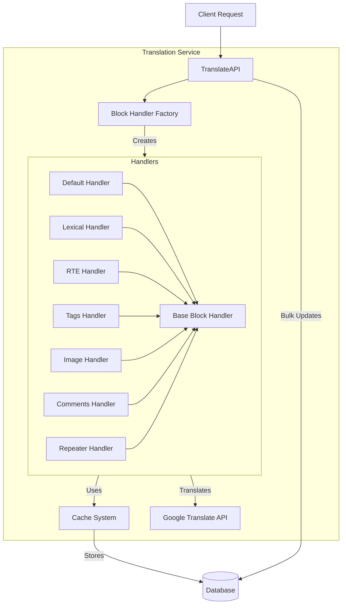

# Auto Translation

## Architecture Diagram



## Overview

The Translation Service is a modular system designed to handle the translation of various content types while maintaining efficient caching mechanisms. It utilizes Google Cloud Translation API and implements a factory pattern for managing different content block handlers.

## Main Translation API

The main translation API is defined in the `translateAPI` function located in the `index.js` file. This function takes the following parameters:

- `docs`: An array of documents to be translated.
- `activeLang`: The target language for translation.
- `tenant`: The tenant identifier.
- `modelsObj`: An object containing the models for different content types.
- `specialValuePaths`: An array of special value paths that are not defined in the template. (ex- comments).
- `translateComp`: An array of component types to be translated (optional, defaults to `DEFAULT_TRANSLATABLE_COMPONENTS`).
- `exclude`: An object specifying component types to be excluded from translation for each content type.
- `showLogs`: A boolean flag to enable or disable logging (optional, defaults to `false`).

## Translation Process

1. The `translateAPI` function in `index.js` is the entry point for the translation process.
2. Iterates over each document in the `docs` array.
3. Checks if the document should be translated based on the `shouldTranslate` utility function.
4. Retrieves the blocks to be translated for the document using the `getDocBlocks` utility function.
5. Filters the blocks based on the specified component types and exclusions.
6. Invokes the appropriate block handler for each block using the `blockHandler` function.
7. The block handler retrieves the original value, checks the cache, and translates the content if necessary.
8. The translated value is set back to the document using the `set_getValOffQueryString` function.
9. If any block is not cached, the translation cache is updated with the current timestamp.
10. The updated documents are saved to the database asynchronously using the `saveTranslationsToDb` function.

## Block Handlers

Block handlers are responsible for handling the translation of specific block types. Each block handler extends the `BaseBlockHandler` class and implements the `handle` method to perform the translation logic.

### Base Block Handler

The `BaseBlockHandler` class provides common functionality for all block handlers. It includes methods for retrieving and setting values from/to the cache, retrieving the original value, and performing translations using the Google Cloud Translation API.

### RTE Block Handler

The `RteBlockHandler` handles the translation of rich text editor (Rich Text Editor) blocks. It retrieves the original value, checks the cache, and translates the blocks if necessary. The translated value is then set in the cache.

### Text Block Handler

The `TextBlockHandler` handles the translation of text fields. It retrieves the original text, checks the cache, and translates the text if necessary. The translated value is then set in the cache.

### Lexical Block Handler

Manages complex text editor translations including:

- Editor state content
- Annotation data fragments

### Repeater Block Handler

The `RepeaterBlockHandler` handles the translation of blocks nested within a repeater. It retrieves the original value, iterates over the nested blocks, invokes the appropriate block handler for each nested block, and updates the original value with the translated values.

### Tags Block Handler

The `TagsBlockHandler` handles the translation of tag display values. It retrieves the original tags, checks the cache, and translates the tag display values if necessary. The translated values are then set in the cache.

### Image Block Handler

The `ImageBlockHandler` handles the translation of image captions. It retrieves the original image value, iterates over the captions, invokes the appropriate block handler for each caption, and updates the original value with the translated captions.

### Comments Block Handler

The `CommentsBlockHandler` handles the translation of comments. It retrieves the original comments, checks the cache, and translates the comment text if necessary. The translated values are then set in the cache.

## Translation Caching

The translation service implements a caching mechanism to avoid redundant translation requests. It stores translated content in the `translations` field of each document.

When a translation is requested, the service first checks if a valid cached translation exists. If found, it uses the cached value. Otherwise, it invokes the translator and updates the cache.

The cache validity is determined by comparing the last modified date of the document with the last translated date stored in the cache.


### Cache Structure

```javascript
translations: {
  [language]: {
    [valuePath]: translatedValue,
    lastTranslated: timestamp
  }
}
```

### Usage Example

```javascript
const result = await translateAPI({
  docs: documentArray,
  activeLang: "es",
  tenant: "tenant-id",
  modelsObj: models,
  specialValuePaths: ["custom.path"],
  translateComp: ["TitleInput", "TextInput"],
  exclude: {
    "content-type": ["ImageInput"],
  },
});
```
