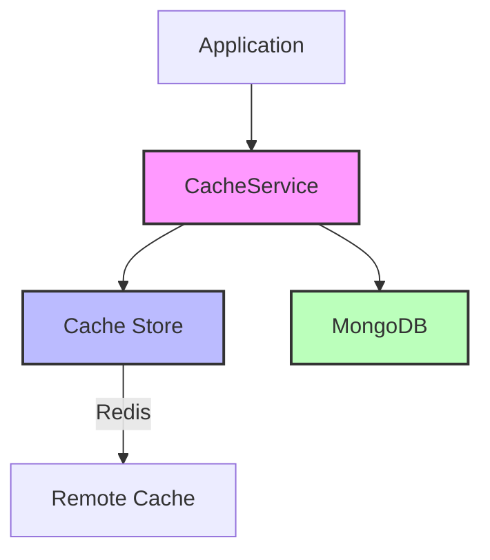
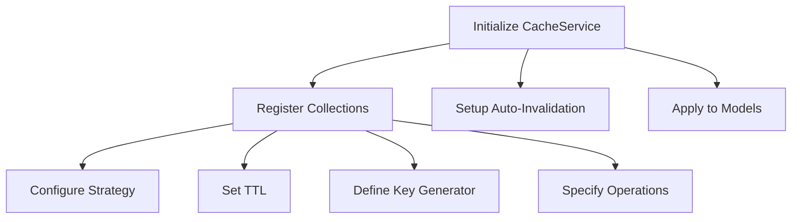
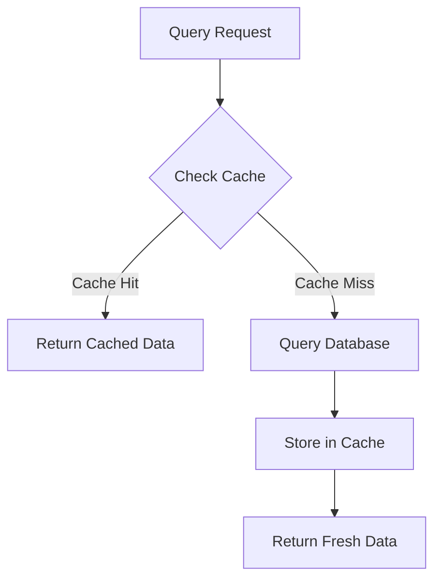
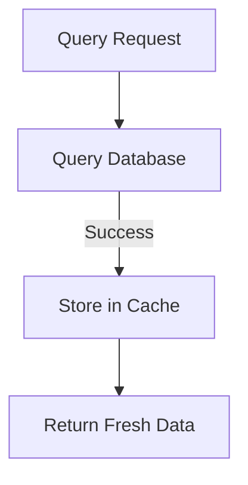
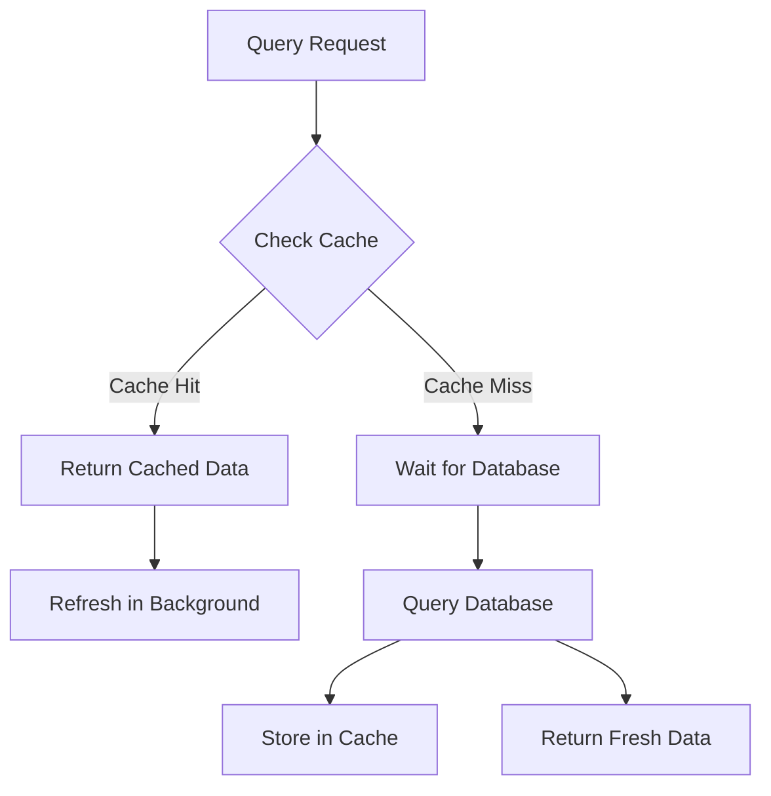
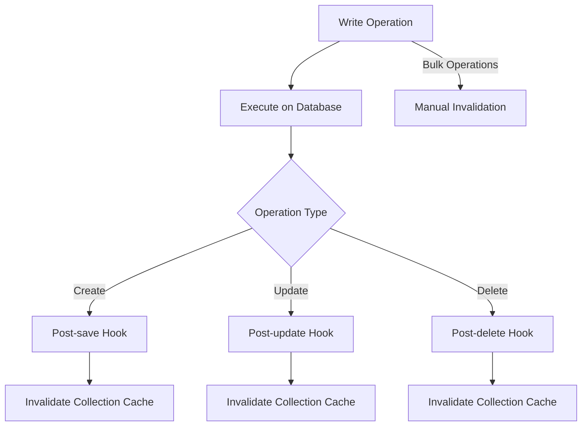
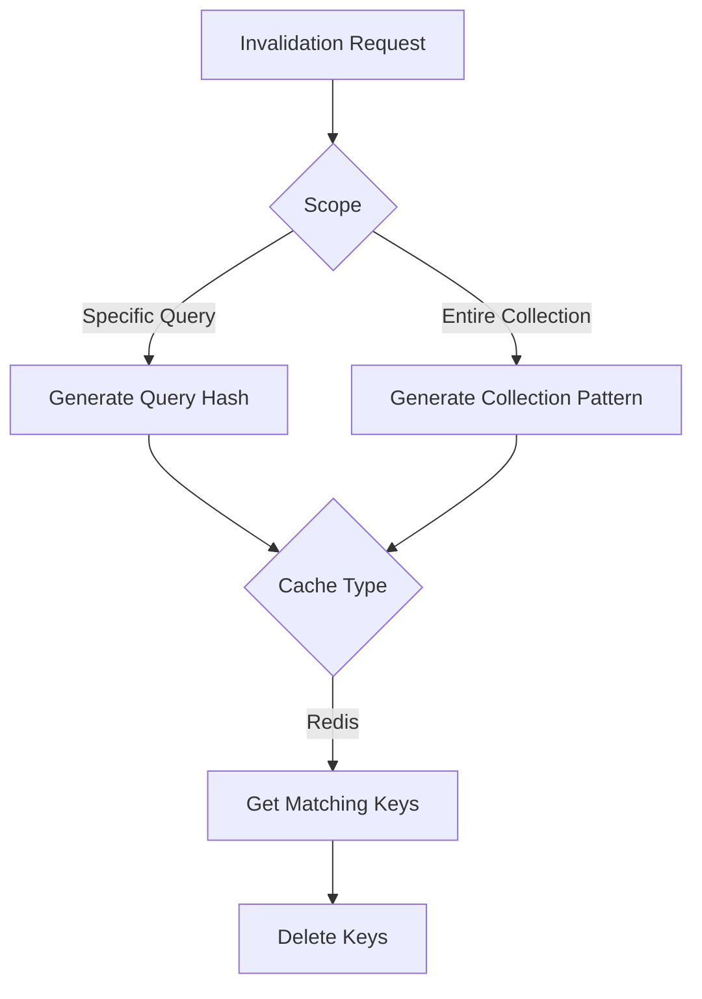
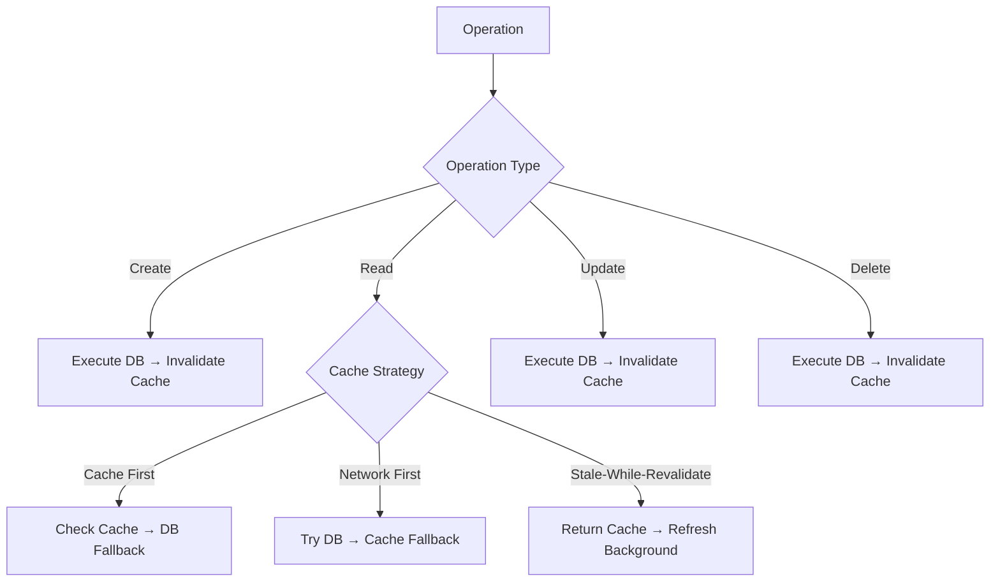
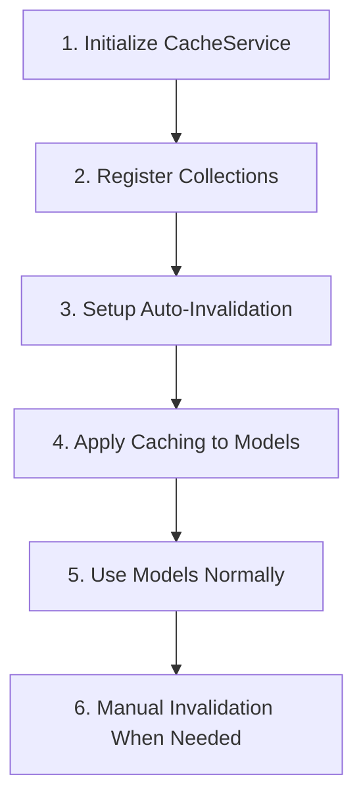

# MongoDB Caching Architecture
## A Strategic Approach to Performance Optimization

---

## Architecture Overview

---

## Configuration Process

---

## Read Operation: Cache-First Strategy

---

## Read Operation: Network-First Strategy

---

## Read Operation: Stale-While-Revalidate

---

## Write Operations Flow

---

## Cache Invalidation Process

---

## CRUD Operations + Cache Matrix

---

## Implementation Steps

# Cache Architecture for CRUD Operations

| Operation Phase | Create (C) | Read (R) | Update (U) | Delete (D) |
|----------------|------------|----------|------------|------------|
| **Cache Check** | ✗ | ✓ | ✗ | ✗ |
| **Execute Database Operation** | ✓ | ✗ OR ✓ | ✓ | ✓ |
| **Cache Update** | ✗  | ✗ OR ✓ | ✗ | ✗ |
| **Cache Invalidation** | ✓ | ✗ | ✓ | ✓ |
| **Strategy Application** | ✗ | ✓ | ✗ | ✗ |
| **Background Refresh** (stale-while-revalidate) | ✗ | ✓ | ✗ | ✗ |
| **Auto-Invalidation via Middleware** | ✓ | ✗ | ✓ | ✓ |
| **Manual Invalidation Support** | ✓ | ✗ | ✓ | ✓ |
| **Collection-Level Invalidation** | ✓ | ✗ | ✓ | ✓ |
| **Query-Specific Invalidation** | ✓ | ✗ | ✓ | ✓ |

## Explanation of Operations

1. **Cache Check**: Only performed during read operations to check if data exists in cache before accessing the database.

2. **Execute Database Operation**: All CRUD operations ultimately execute against the database.

3. **Cache Update**: Only read operations update the cache with fresh data (depending on caching strategy).

4. **Cache Invalidation**: Create, update, and delete operations trigger cache invalidation to maintain consistency.

5. **Strategy Application**: Caching strategies (cache-first, network-first, stale-while-revalidate) only apply to read operations.

6. **Background Refresh**: Only applicable in read operations with stale-while-revalidate strategy.

7. **Auto-Invalidation via Middleware**: Mongoose middleware automatically invalidates cache entries for create, update, and delete operations.

8. **Manual Invalidation Support**: Available for create, update, and delete operations when automatic invalidation isn't sufficient.

9. **Collection-Level Invalidation**: Entire collections can be invalidated on bulk create, update, or delete operations.

10. **Query-Specific Invalidation**: Specific queries can be invalidated based on document IDs for targeted create, update, or delete operations.

