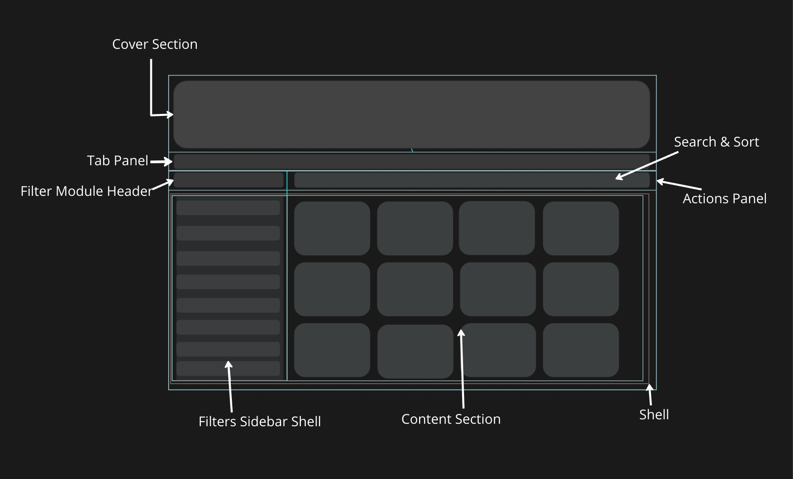

### Anatomy of Listing Page


## Architecture Overview

The listing functionality is implemented through two main components:

1. `ListingPage` - Parent container component
2. `ListingRenderer` - Content rendering component

```
ListingPage
├── CoverSection
├── TabsPanel
└── BodyContent
    ├── ListingRenderer
    ├── FormRenderer
    └── CustomCompRenderer
```

## ListingPage Component

### Overview

ListingPage is a container component that manages the overall layout and structure of listing pages. It handles the cover section, tabs panel, and different types of content renderers.


### Key Features

- Responsive layout management
- Cover section with image/video support
- Tabbed interface
- Multiple content renderer support
- Mobile-specific optimizations
- Scroll effects management

### Props Structure

```typescript
interface ListingPageProps {
  bodyConfig?: {
    value: string;
    comp: "ListingRenderer" | "FormRenderer" | "CustomCompRenderer";
    props: any;
  }[];
  tabBarConfig?: {
    value: string;
    options: any[];
    onChange: (value: string) => void;
  };
  coverConfig?: {
    coverExists: boolean;
    title: string;
    desc?: string;
    btn?: any;
    content?: any;
    coverImage?: any[];
    coverVideo?: any;
    metaPrimary?: any;
    tagsIntro?: any;
  };
  collectionId?: string;
}
```

### Components

#### 1. CoverSection

Displays the header area with:
- Title and description
- Background image or video
- Metadata and tags
- Custom buttons
- Scroll-based effects

#### 2. TabsPanel

Manages tabbed navigation with:
- Configurable tab options
- Active tab state
- Mobile-responsive layout
- Sticky positioning

#### 3. Content Renderers

Three types of content renderers:
- ListingRenderer (main content listing)
- FormRenderer (form displays)
- CustomCompRenderer (custom components)


## ListingRenderer Component

### Overview

ListingRenderer handles the display and management of content items with filtering, sorting, and search capabilities.

### Key Features

- Multiple view styles (Cards, List, Table)
- Advanced filtering system
- Search functionality
- Sorting capabilities
- CSV export
- Lazy loading
- Session storage persistence
```

### Props Structure

```typescript
interface ListingRendererProps {
  contentTypes: string[];
  configs: {
    sortConfig?: any[];
    getDataQuery?: string;
    getDataConfig?: object;
    filterConfig?: {
      filters: any[];
      filterModuleOrientation?: string;
    };
    listingStyle?: "CardsStyle" | "ListStyle" | "TableStyle";
    listingConfig?: object;
    keywordSearchConfig?: {
      fields: string[];
      disabled?: boolean;
    };
  };
  tabsPanelHeight: number;
  actionBarHeight: number;
  actionRef: React.RefObject<any>;
  isMobile: boolean;
  setShowSideBarLeft: (show: boolean) => void;
  showSideBarLeft: boolean;
  collectionId?: string;
  stickyTitleHeight: number;
  coverConfig?: any;
}
```

### Main Components

#### 1. Shell
Main layout container that organizes:
- Content area
- Sidebar
- Mobile responsiveness

#### 2. ActionsPanel
Controls panel containing:
- Search functionality
- Sort options
- Filter controls
- CSV export options

#### 3. FilterModule
Advanced filtering system with:
- Multiple filter types
- Filter persistence
- Mobile-optimized view
- Preset filters support

#### 4. ListingModule
Content display component with:
- Multiple view styles
- Lazy loading
- Error handling
- Empty states


## Implementation Guide

### Basic Usage

```jsx
import ListingPage from './components/ListingPage';

const MyListingPage = () => {
  return (
    <ListingPage
      coverConfig={{
        coverExists: true,
        title: "My Listing",
        desc: "Description here",
        coverImage: [{ publicUrl: "image-url" }]
      }}
      bodyConfig={[
        {
          value: "listing",
          comp: "ListingRenderer",
          props: {
            contentTypes: ["article"],
            configs: {
              listingStyle: "CardsStyle",
              filterConfig: {
                filters: [/* filter config */]
              }
            }
          }
        }
      ]}
    />
  );
};
```

### Advanced Configuration

#### Cover Section Config
```javascript
const coverConfig = {
  coverExists: true,
  title: "Page Title",
  desc: "Page Description",
  coverImage: [{
    publicUrl: "image-url"
  }],
  metaPrimary: {
    valuePath: 'metaData'
  },
  tagsIntro: {
    valuePath: 'tags'
  }
};
```

#### Tabs Configuration
```javascript
const tabBarConfig = {
  value: "listing",
  options: [
    { label: "List View", value: "listing" },
    { label: "Form View", value: "form" }
  ],
  onChange: (value) => handleTabChange(value)
};
```

## Mobile Responsiveness

### Features
- Adaptive layouts
- Touch-friendly controls
- Collapsible sidebars
- Optimized cover section
- Mobile-specific scroll effects

### Implementation
```javascript
const isMobile = screenWidth < getBreakPoint("md");

// Mobile-specific wrapper
{isMobile && (
  <MobileBGCoverWrapper
    coverConfig={coverConfig}
    coverBlur={coverBlur}
    coverShift={coverShift}
  />
)}
```

## State Management

### Session Storage
- Filter preferences
- Search terms
- Sort settings
- View preferences

### Scroll Effects
- Cover section animations
- Sticky header management
- Mobile scroll optimizations

## Best Practices

1. **Performance Optimization**
   - Implement lazy loading
   - Optimize image loading
   - Use proper breakpoints
   - Manage re-renders efficiently

2. **Mobile First Development**
   - Design for mobile first
   - Test on multiple devices
   - Implement touch-friendly controls
   - Optimize for different screen sizes

3. **Error Handling**
   - Implement proper error boundaries
   - Handle network errors gracefully
   - Provide meaningful error messages
   - Handle edge cases appropriately

4. **State Management**
   - Use session storage effectively
   - Implement proper state updates
   - Handle side effects properly
   - Manage complex state with proper tools

5. **Configuration**
   - Use meaningful defaults
   - Validate configurations
   - Document all options
   - Provide type definitions

## Common Issues and Solutions

1. **Mobile Scroll Performance**
```javascript
const useScrollEffectsManager = ({ 
  tabsPanelHeight, 
  actionBarHeight 
}) => {
  // Implement scroll optimization logic
};
```

2. **Filter State Persistence**
```javascript
const sessionStorageKey = `ListingPage__${collectionId}`;
const sessionData = JSON.parse(
  sessionStorage.getItem(sessionStorageKey)
);
```

## API Reference

### ListingPage Props

| Prop Name | Type | Required | Description |
|-----------|------|----------|-------------|
| bodyConfig | array | No | Content renderer configurations |
| tabBarConfig | object | No | Tab panel configuration |
| coverConfig | object | No | Cover section configuration |
| collectionId | string | No | Unique identifier for the page |

### ListingRenderer Props

| Prop Name | Type | Required | Description |
|-----------|------|----------|-------------|
| contentTypes | array | Yes | Content types to display |
| configs | object | Yes | Main configuration object |
| tabsPanelHeight | number | Yes | Height of tabs panel |
| actionBarHeight | number | Yes | Height of action bar |
| isMobile | boolean | Yes | Mobile view flag |

## Contributing Guidelines

1. Follow established patterns
2. Document new features
3. Test mobile responsiveness
4. Ensure backward compatibility
5. Update documentation
6. Test scroll effects
7. Validate configurations

## Related Components

- FilterModule
- ListingModule
- ActionsPanel
- CoverSection
- TabsPanel
- Shell
- ErrorStates

This documentation provides a comprehensive overview of both the ListingPage and ListingRenderer components, their features, implementation details, and best practices for usage.


The component manages several key states:

- `activeFilters`: Current filter selections
- `searchTermInputValue`: Search functionality control
- `activeSort`: Sorting preferences
- Session Storage: User preferences persistence


### Required Props

```typescript
interface ListingPageProps {
  contentTypes: string[];          // Content types to display
  configs: ConfigObject;           // Main configuration object
  presetActiveFilters?: Filter[]; // Pre-defined filters
  collectionId?: string;          // Unique collection identifier
  showCount?: boolean;            // Toggle count display
  showSearchInput?: boolean;      // Control search visibility
  listingExport?: boolean;        // Enable CSV export
  enableLazyLoad?: boolean;       // Toggle lazy loading
}
```

### Configuration Object Structure example

```javascript
 {
    "getDataConfig": {
      "findQuery": {
        "kp_published_status": "published"
      },
      "population": [
        {
          "path": "meta.kp_contributed_by",
          "model": "user",
          "select": [
            "name",
            "avatar"
          ]
        }
      ],
      "useAggregation": true,
      "lookupConfig": [
        {
          "$lookup": {
            "from": "users",
            "localField": "meta.kp_contributed_by",
            "foreignField": "_id",
            "as": "meta.kp_contributed_by",
            "pipeline": "[{…}]" 
          }
        },
        {
          "$unwind": {
            "path": "$meta.kp_contributed_by",
            "preserveNullAndEmptyArrays": true
          }
        }
      ]
    },
    "listingStyle": "CardsStyle",
    "listingConfig": {
      "configs": {
        "cardLabel": "$thisContentType",
        "title": "main.title",
        "image": [
          "main.uploadImagesRelatedToTheActivity"
        ],
        "metaBlock": [
          {
            "key": "name",
            "valuePath": "meta.kp_contributed_by.name"
          },
          {
            "key": "date",
            "valuePath": "kp_date_published"
          }
        ]
      }
    },
    "sortConfig": [
      {
        "display": "Latest",
        "sort": {
          "kp_date_published": -1
        },
        "value": "newest"
      },
      {
        "display": "Oldest",
        "sort": {
          "kp_date_published": 1
        },
        "value": "oldest"
      }
    ],
    "filterConfig": {
      "filters": [
        {
          "category": {
            "value": "contentTagFilter",
            "display": "Content Tag Filter",
            "tooltip": "These filters filter content based on tags that have been applied on the content itself."
          },
          "filterId": "contentTagFilter_mainTypeOfReport",
          "display": "Type of Report",
          "source": {
            "filterType": "tplType",
            "contentType": "reports",
            "valuePath": "main.typeOfReport"
          },
          "target": {
            "filterType": "valuePathType",
            "valuePath": "main.typeOfReport.value"
          },
          "autoExtracted": true
        }
        // Additional filters...
      ],
      "filterModuleOrientation": "sidebar"
    },
    "keywordSearchConfig": {
      "fields": [
        "main.title.autoComplete"
      ]
    },
    "coverConfig": {
      "title": "Learning Reports",
      "desc": "Here you will find resources and reports emerging from various Needs Finding, Co-creation and Feedback testing activities conducted in different geographies and for different condition areas",
      "btn": {
        "text": "Add here",
        "action": "action() {}"
      }
    }
  }
```
